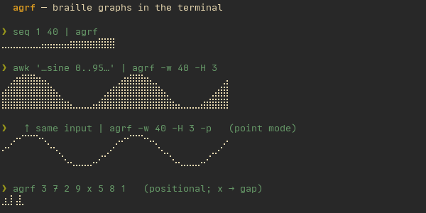

# agrf

[](https://github.com/rmrfus/agrf/actions/workflows/ci.yml)
[](https://github.com/rmrfus/agrf/releases/latest)
[](LICENSE)

Turn a stream of numbers into a compact braille unicode graph, right in the
terminal. Reads `int`/`float` from stdin (or positional args), draws a
sparkline / bar chart using braille dots (U+2800) — 8 pixels per character,
so a lot of signal fits in very little width.



> Real terminal output. Braille needs a monospace font that renders U+2800
> properly (any decent terminal font does) — GitHub's web font doesn't, which
> is why the graphs here are a screenshot, not copy-pasteable text.

## Install

### As a Nix package (flake)

The flake exposes a `default` package — no clone needed:

```sh
nix run   github:rmrfus/agrf -- 3 7 2 9   # run without installing
nix build github:rmrfus/agrf              # ./result/bin/agrf
nix profile install github:rmrfus/agrf    # install into your profile
```

Pull it into a NixOS / home-manager flake as an input:

```nix
inputs.agrf.url = "github:rmrfus/agrf";
inputs.agrf.inputs.nixpkgs.follows = "nixpkgs";   # reuse your nixpkgs, not agrf's pin
# then, where inputs + pkgs are in scope:
environment.systemPackages = [ inputs.agrf.packages.${pkgs.system}.default ];
# home-manager: home.packages = [ inputs.agrf.packages.${pkgs.system}.default ];
```

### With Cargo

On any host with Rust 1.85 or newer, no Nix required (builds locally). The
floor comes from edition 2024 and is checked in CI:

```sh
cargo install --git https://github.com/rmrfus/agrf --locked
```

### Prebuilt binaries

Static musl binaries for x86_64 / aarch64 / armv7 hang off each
[release](https://github.com/rmrfus/agrf/releases):

```sh
curl -fsSL https://github.com/rmrfus/agrf/releases/latest/download/agrf-x86_64-linux.tar.gz | tar xz
./agrf --version
```

Checksums are in `SHA256SUMS` on the same release.

### From a local checkout

```sh
direnv allow            # cargo/rustc from the flake devShell (or: nix develop)
cargo build --release   # ./target/release/agrf
cargo install --path .  # or drop it onto your PATH
```

`cargo install` copies the binary and nothing else, so the man page needs the
Makefile. It honours the usual `PREFIX`/`DESTDIR`:

```sh
make && sudo make install                  # /usr/local
make && make install PREFIX="$HOME/.local"
make install DESTDIR="$pkgdir" PREFIX=/usr # packaging
```

## Usage

```
agrf [OPTIONS] [VALUES]...
```

Values come from positional args if given, otherwise from stdin
(whitespace/newline separated).

| Flag               | Default | Meaning                                                     |
|--------------------|---------|-------------------------------------------------------------|
| `[VALUES]...`      | —       | numbers to plot; if omitted, read from stdin                |
| `-w, --width <N>`  | `20`    | width in characters (holds `2*N` values)                    |
| `-H, --height <N>` | `1`     | height in characters (4 px per char)                        |
| `--min <F>`        | `0`     | Y-axis floor; values below are clamped                      |
| `-m, --max <F>`    | auto    | Y-axis top; values above are clamped (window max)           |
| `-p, --point`      | off     | draw only the marker at each value, no fill (default: bars) |

Behavior worth knowing:

- **One value = one pixel column.** Two columns per braille char, so a `W`-wide
  graph shows the last `2*W` values.
- **Fills left to right.** More values than fit → the last `2*W` are kept;
  fewer → they sit on the left, blank on the right.
- **Y range is `--min`..`--max`** (defaults `0`..window-max); out-of-range
  values clamp to it. For data that lives in a band — CPU temp at 40–80 °C —
  set `--min` so the graph uses the full height instead of hugging the top.
- **Non-numeric tokens become gaps** (empty column), negatives vanish at the
  default floor of 0, and any value above the floor shows at least one pixel so
  small bars don't disappear.

## Examples

The screenshot above covers `seq`, a sine wave (bars and point mode), and
positional input with a gap. A few more ways to feed it:

Ping latency as a sparkline:

```sh
ping -c 20 1.1.1.1 | grep -oP 'time=\K[0-9.]+' | agrf -w 20 -H 2
```

Noise from `/dev/urandom` (uniform bytes 0–255) as bars:

```sh
head -c 40 /dev/urandom | od -An -tu1 -v | tr -s ' ' '\n' | grep . | agrf -w 20
```

A random walk, two chars tall:

```sh
awk 'BEGIN{x=50;for(i=0;i<60;i++){x+=int(rand()*21)-10;if(x<0)x=0;if(x>100)x=100;print x}}' | agrf -w 30 -H 2
```

CPU temperature sampled once a second, scaled to a 40–90 °C band so the
variation shows (0-based would glue it to the top):

```sh
for _ in $(seq 60); do awk '{print $1/1000}' /sys/class/thermal/thermal_zone0/temp; sleep 1; done \
  | agrf -w 30 --min 40 --max 90
```

## License

MIT — see [LICENSE](LICENSE).
